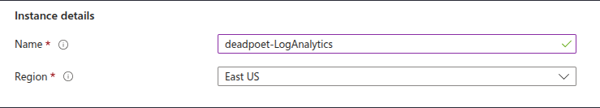
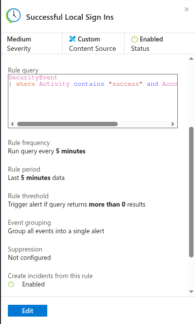

## The Journey Begins: Why I Built a SIEM Home Lab

Like many aspiring cybersecurity professionals, I wanted to get hands-on experience with real security tools. Reading about SIEMs is one thing, but actually building one? That's where the real learning happens. So I rolled up my sleeves and dove into Microsoft Azure Sentinel to create my own Security Operations Center (SOC) in the cloud.

Spoiler alert: It was easier than I thought, but way more powerful than I imagined.

(description: Screenshot showing the Azure VM creation page with deadpoet-VM1 configuration, RDP port 3389 exposed, and network settings)
*Setting up my honeypot VM - intentionally exposed to see what happens*

## What Exactly Did I Build?

In simple terms, I created a digital security camera system for computers. My SIEM watches everything happening on a Windows server, looking for suspicious activity like:
- Failed login attempts (potential brute force attacks)
- Successful system account logins (possible privilege escalation)
- Unusual access patterns
- Security event anomalies

The architecture is straightforward but powerful:
1. **A Windows VM** acting as my monitored endpoint (and honeypot)
2. **Azure Monitor Agent** shipping logs to the cloud
3. **Log Analytics Workspace** storing and indexing everything
4. **Microsoft Sentinel** applying detection rules and creating alerts

## The Setup Process: Easier Than Expected

### Step 1: Creating the Infrastructure

The first step was spinning up a Windows virtual machine. I named it "deadpoet-VM1" (yes, I'm a fan of poetry and irony). I deliberately exposed RDP (port 3389) to make it an attractive target for attackers. In a production environment, you'd never do this – but for learning? Perfect.

(description: Screenshot showing the Log Analytics workspace configuration with name "deadpoet-LogAnalytics" and East US region selected)
*The brain of the operation - Log Analytics workspace where all the magic happens*

### Step 2: Connecting the Dots

Here's where it got interesting. I connected my VM to Azure Sentinel using the Azure Monitor Agent (AMA). This lightweight agent acts like a security camera, continuously streaming Windows Security Events to my cloud workspace. The configuration was surprisingly straightforward:
- Install agent on VM ✓
- Connect to Log Analytics ✓
- Select "All Security Events" ✓
- Watch the data flow in ✓

### Step 3: Writing My First Detection Rule

This is where I felt like a real security analyst. Using Kusto Query Language (KQL), I wrote my first detection rule:

```kusto
SecurityEvent
| where Activity contains "success" and Account contains "system"
```

Simple? Yes. Effective? Absolutely. This rule catches successful system account logins – often a sign of privilege escalation or unauthorized access.

(description: Screenshot showing the analytics rule configuration with the KQL query, 5-minute frequency, and alert settings)
*Creating my first detection rule - catching suspicious system account activity*

## The "Aha!" Moments

### Moment 1: The Power of KQL

At first, KQL seemed like just another query language. Then I realized I could search through millions of events in seconds, correlate activities across time, and identify patterns that would be impossible to spot manually. It's like having superpowers for log analysis.

### Moment 2: Real Attacks, Real Time

Within hours of exposing my VM, I started seeing real attack attempts. Bots from around the world were trying to brute force my RDP connection. Watching these attacks in real-time through Sentinel was both terrifying and exciting. This wasn't a simulation – these were real threats being detected and logged.

### Moment 3: Automation Is Everything

Setting up automated incident creation changed my perspective. Instead of manually reviewing logs, Sentinel automatically:
- Runs my detection rules every 5 minutes
- Groups related alerts into incidents
- Assigns severity levels
- Creates an audit trail

This is how real SOC teams handle thousands of events per day without drowning in data.

(description: Screenshot showing the completed alert rule "Successful Local Sign Ins" with Medium severity, 5-minute frequency, and incident creation enabled)
*The final rule configuration - automated detection running 24/7*

## Challenges and Lessons Learned

### Challenge 1: Cost Management
Azure's free tier is generous, but logs add up quickly. I learned to:
- Filter unnecessary event types
- Set appropriate retention periods
- Use sampling for high-volume data sources

### Challenge 2: False Positives
My first rule generated tons of alerts. Legitimate system activities looked suspicious. I had to refine my queries, adding context and thresholds to reduce noise while maintaining detection capability.

### Challenge 3: Understanding the Data
Windows generates thousands of different security event types. Learning which ones matter for security took time and research. Pro tip: Start with the critical ones (4624, 4625, 4672) and expand from there.

## Key Takeaways

1. **Start Simple**: You don't need to build a complex SIEM on day one. Start with basic detection rules and expand.

2. **Learn KQL**: This query language is incredibly powerful. The time invested in learning it pays dividends.

3. **Embrace Automation**: Manual log review doesn't scale. Let the SIEM do the heavy lifting.

4. **Practice Incident Response**: Having alerts is useless if you don't know how to investigate them.

5. **Security Is Continuous**: Threats evolve, and so should your detection rules.

## What's Next?

This project opened my eyes to the world of security operations. I'm planning to:
- Add Linux systems to monitor
- Integrate threat intelligence feeds
- Build custom dashboards
- Create automated response playbooks
- Simulate more sophisticated attacks

## Final Thoughts

Building this SIEM taught me that security monitoring isn't about catching every attack – it's about visibility, automation, and continuous improvement. What seemed like "mundane clicking" was actually me building a sophisticated security apparatus that enterprises use to protect millions of dollars in assets.

The best part? Everything I learned is directly applicable to real-world security operations. Whether you're defending a small business or a Fortune 500 company, the principles remain the same: collect, detect, investigate, respond.

If you're on the fence about building your own SIEM lab, my advice is simple: do it. The hands-on experience is invaluable, the skills are in high demand, and honestly, watching hackers try (and fail) to breach your defenses is pretty satisfying.

## Resources for Your Journey

- **Microsoft Learn**: Free Azure Sentinel training modules
- **KQL Documentation**: Master the query language
- **Azure Free Tier**: $200 credit to get started
- **GitHub**: My project repository (link in bio)
- **Community**: r/azure, r/siem, and Azure Sentinel community
