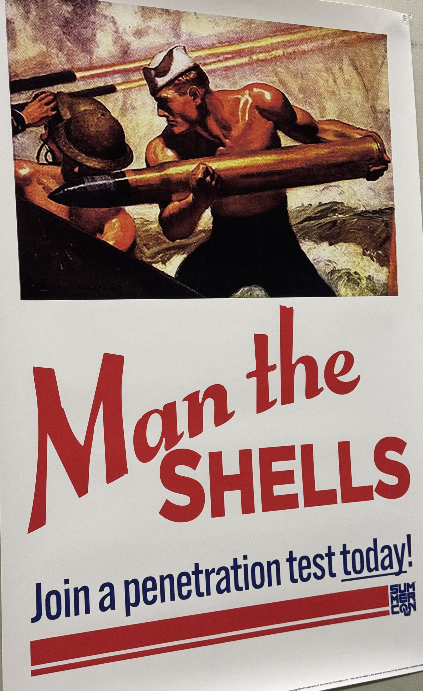
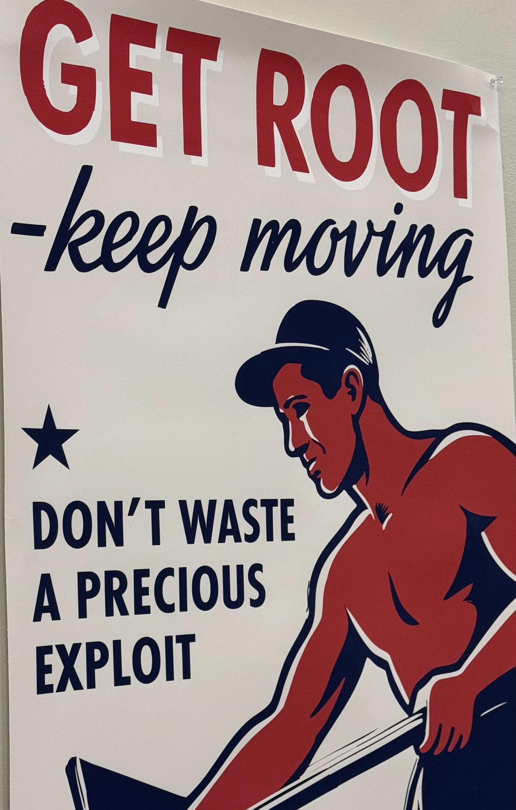
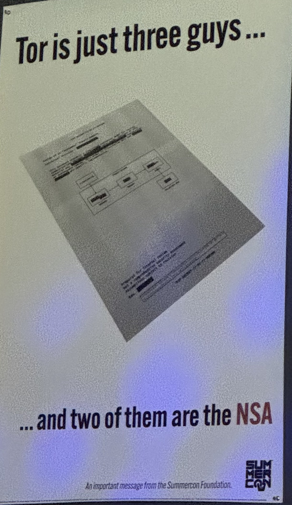

I have always loved going to security meetups. When I first moved to Boston, it was meetups like OWASP Boston, Boston Security, and my favourite, Boston Hackers, that pulled me in. Now I am just back from the second day of the biggest security conference I have ever been to, sitting on my bed in a nice hotel in NYC and writing this blog post (unlike some nerds who are probably partying at the Lucky 13 Saloon).

  
  
  

*A few of the posters from around the venue*

The main reason I am writing this blog is to revisit all the talks I listened to at the con, and hopefully express what I felt there to everyone who couldn't make it. Given that this was my first actual hacking conference, I was in awe of most of it, so if you end up thinking, "Man, this guy is positive about everything, was he paid by summercon??", the answer is no. And yes, I am mostly positive. There were a few things I thought were bad, but they add up to maybe 0.03% of the whole thing.

Okay, enough bullshit. Allow me to take you on a journey where I narrate my trip to my first hacking conference, SummerCon 2026.

The trip started at my hotel. I was already running late because of some credit card problems that morning, and I ended up missing the first two talks, namely

- Building a Windows N-Day Exploit Chain for RasMan 
- Unlocking cars: Reversing a Rolling Code like a boss 

So I won't pretend I was there and hand you a fake experience, but if you want to watch them, you can head to the summercon youtube page where all the talks are posted. What follows are my top five talks from the con, the ones I keep coming back to since getting home. Starting off with the first talk that I actually attended:

## Hunting for North Korean Malware
by Ramazan Uysal

Some parts of this talk I could not cover since the author marked them as TLP:RED, so I have left those out here.

The framing was that the old North Korea used to speak loudly and carry a small stick, but under Kim Jong Un the country started carrying a much bigger one. The list of operations makes that point on its own: the Sony hack, the Bangladesh Bank heist, the Bybit breach, and the Axios compromise. What ties these together is that North Korean operators run from a playbook, and they rarely deviate from it unless it stops working, at which point they only shift it slightly. Researchers call this playbook the contagious interview.

The contagious interview flow looks like this. Operators recruit targets with false hopes, point them to fake repositories on GitHub, and host those repositories on Bitbucket rather than AWS. From there they deliver malware such as BeaverTail and InvisibleFerret, and the interaction ends in compromise. The Axios attack was essentially an improved instance of this same contagious interview playbook.

On attribution, the picture is that the Lazarus Group could be working alongside other smaller hacker groups inside North Korea. A given operator could be part of Lazarus and later move into a manager role, or the work could simply be a form of outsourcing. GitLab's threat intelligence team has documented several trademarks of these operations that make them easier to spot.

The repository names cluster around a recognizable set of themes: MVP, DEFI, and Staking on the crypto side, and Real Estate and Royal* on the other. The email addresses used to drive these operations follow a distribution too, with 371 on Gmail, 224 on Outlook, 169 on Hotmail, and 20 on ProtonMail. The operators reuse common filenames across their repositories and lean on a common C2 domain that is chosen so the traffic looks legitimate.

Infrastructure choices are another tell. The VPN and proxy providers of choice were AstrillVPN, ProxySeller, and IPRoyal. These happen to be among the best VPNs available in China, which matters because most of these groups appear to be operating out of China. On the social side, LinkedIn accounts and entities like Bethany Tanya Cabahug and Shabak Consultants Inc have been linked to these North Korean operations.

The delivery techniques covered were embedded payloads, over 2000 malicious NPM dependencies (the most heavily used vector), Git hooks (which have risen recently, where a script placed in a .githooks/pre-commit hook runs before any GitHub action), VSCode autorun, and fake font files. Socket.dev has published research specifically on the backdoored NPM packages in this space.

The talk closed with practical hunting tips. You can pivot on the AstrillVPN usage, on the email patterns, and on the Referer header. On the Referer side, a Bitbucket link shared on LinkedIn is most probably a scam, and the same caution applies to links coming through Freelancer, Upwork, and AI or LLM tooling. Beyond that, hunt on the repository names, on the NPM indicators of compromise, and with YARA rules.

The second talk that I enjoyed on day 1 was a bit more technical and it was hiding some really complex concepts behind a very fun topic of game hacking.

---

## Advanced WebKit Exploitation: how the attackers in DarkSword went from R/W to full code execution
by Matthias Frielingsdorf

This talk walked through an iOS 18.4 to 18.6.2 exploit chain. In the author's own words, it details some of the latest mitigations in WebKit and how they were bypassed by the DarkSword exploit chain, which was discovered in the wild. Most of us remember the good old days where you could just overflow a buffer and jump to shellcode, but those days are long gone and exploitation is more of a challenge now. The talk explored later mitigations in WebKit such as PAC and TPRO (the latter of which had not been covered publicly before) and detailed how the attackers bypassed them.

DarkSword itself was found at a JavaScript module hosted at static.cdncounter.net/assets/rce_module.js, and the chain maps to CVE-2025-31277, CVE-2025-43529 (tracked internally as 14174), CVE-2025-43510, and CVE-2025-43520.

The heart of the talk was the interaction between Apple's protections. On the problem side sit Shadow Permission Remap Registers (SPRR) and Trusted Path Read Only (TPRO). On the mitigation side sit Pointer Authentication Codes (PAC), which relies on zero diversified pointers, and the JIT Cage, which protects JIT-cage code from malicious overrides. The bypasses came from playing these off against each other, with SPRR set against the JIT Cage, and an effective TPRO bypass set against PAC in the case of DarkSword.

For the actual control flow, DarkSword carried two JOP chains, one to call functions with three arguments and one to call with six arguments. The JOP chain trigger came through a blraaz instruction, reached by way of DDFAScannerFirstResultInUnichararray, a phone number path, and a trampoline. The end result of the chain was kernel arbitrary memory read and write.

---

## Models for Shaping Adversary Behavior
by Tom Cross

The thesis here was that you should know more about the area you defend than the APT group operating in it does. From there the talk asked what we are actually getting from the AI companies. At the base you get text prediction, but on top of that you get emergent behaviours: novel composition, search, and novel connections. You also get an LLM wired to state, an LLM wired to Python that turns into an app (even to solve math), and an LLM wired to picture manufacturing. The point is that what you are looking at is a system architecture, not just a text model.

What is still missing is a world model bound to the LLM. An LLM cannot look at a picture and know what happens next. The example was that if you throw a ball and record it, a person watching will know from the very first frame that the ball is going to move across the frame, while the LLM will not.

The defensive framework was Effects Based Operations (EBO), which is about taking actions to achieve a specific effect. Cross laid these out on a spectrum from low to high impact: endpoint hardening, blocking country IPs, exiting a market, account throttling, and vulnerability injection. The organizing question is how you can put pressure on your adversary.

To decide where to apply that pressure, he brought in Center of Gravity (COG) analysis, which is how the military decides what to hit. It breaks down into centers of gravity, critical capabilities, critical requirements, and critical vulnerabilities. Here critical vulnerabilities are not CVEs, they are the things that can break the operation. The mental model is to find the small pebble that has to be maintained for a specific application to work, and then break that pebble.

As a real example, someone had hacked LockBit's admin panel (work attributed to jambul), which is worth going to look at. Part of the takeaway there was that LockBit used Mega instead of S3, and Mega is a bad choice, so again the lesson is to look for the pebble.

He also introduced integrated gain loss analysis, spanning business gain loss, network gain loss, and intelligence gain loss, which overlap as a Venn diagram worth drawing out. The related operational point is that you should not kick out an APT immediately. They will come back through a different path, and while they are still present you know where they are, so it is often better to learn more about them before removing them.

The last portion covered the wider context of applying COG. As you act you are climbing a risk scale, since operations can carry reputational, legal, and other risks. He pointed to the ICRC rules for cyber combatants from the Comite international de Geneve, and the idea of the civilianization of the digital battlefield, which addresses how anyone could become a party to the conflict and is a serious global concern. Finally there is the collective operations angle, covering capabilities, operations, and legal work, including working with allies.

---

## Dude, Where's My Implant? Disappointing all of my compiler friends at once
by Kai (kbsec)

In the presenter's framing, exploitation on hardened platforms is increasingly constrained. Modern mitigations deny a viable path to execute unsigned code or corrupt page tables, which makes a successful kernel read/write primitive insufficient for running a native payload. Instead of being limited by these post-exploitation hurdles, the question was what if native payloads could be compiled directly into the exploit in a mitigation-friendly way. That idea is Handoff-Oriented Capabilities (HOC), which redefines offensive capability not as dropping a separate binary at the end of a chain, but as instantiating a target-native weird machine whose logic is realized entirely through mechanisms already present on the target.

The motivating example was Context-Oriented Programming (COPr), powered by setcontext on aarch64 glibc. The COPr C compiler converts native C code into a non-executable artifact called a context tape, which is constructed using memory read and write primitives. Chaining these context restorations achieves reliable computation while still adhering to coarse-grained control-flow policies. This reframes the implant as an exploit-resident artifact that leverages the initial read/write primitive rather than replacing it with injected code, and the talk demonstrated compiling a fully featured C program into COPr context tapes and running the resulting weird machine against a modern vulnerable binary.

The starting point was that ROP is not really feasible in 2026, and DarkSword is a useful case study because it could not get any executable memory. DarkSword was written in JavaScript, was a leaked exploit chain targeting iOS, and JavaScript was the natural choice because you get an interpreter and a lot of bugs to work with.

The strategies for dealing with a lack of shellcode were laid out as options: wire up a native bridge to an interpreter, pray for a JIT and just live there, find some really useful objects, or fall back to JOP. The demonstration used armv8-a on Linux, working within the armv8-a calling convention, and built on context-oriented programming. The key field is uc_link, which holds the address of the next context to jump to.

For the primitives, the capture gadget was built from malloc(n), pthread_create, and pthread_join. Computation was done through a lookup table (LUT) laid out as i by j at 256 by 256. Storage went into open file descriptors, writing to them and using pread and pwrite for access. Indexing into the LUT was how arithmetic got implemented, so addition became looking up i plus j, and the table itself was built with a nested for loop. There was also a swab-based path, where memcpy into swab into memcpy did the work. On top of this, COPr carries its own version of the GOT and its own version of the got.plt, giving the weird machine an ELF-like structure to resolve against.

---

## Back to the Future: Owning Systems of the Past
by Nick Gregory & Brendan Dolan-Gavitt

The framing from the presenters was that the 80s, 90s, and early 00s were a wild time in computing. Things moved at a rapid clip, technology still had style, and strange ideas were everywhere, right down to machines that only ran Lisp. Their question was simple: can we go back and hack all of it? What followed was a process for pwning most every old operating system you have heard of, and a few you probably have not. In total they presented 16 zero-days across 12 platforms spanning 8 architectures, and walked through what it took to emulate these vintage systems, how they convinced an AI to reverse engineer them, and how they got it to write 90s style keygens to unblock itself so it could keep going.

The two big roadblocks were emulation and licensing. Emulation was the harder engineering problem, and licensing was solved the way these things tend to get solved on old software. For getting the AI to actually understand the binaries, they used two strategies. The first was a Ghidra MCP so the model could drive the decompiler directly. The second was pre-decompilation, where they decompiled the target ahead of time and then ran the LLM over the output.

On emulation, one of the tricky cases was running VAX on Alpha, largely because of VAX floating point, which is not IEEE. The workhorse for most of the effort was QEMU, chosen because it gives you snapshots, good performance, and it is free.

The targets and the systems they ran on were:

1. Mosaic 2.4 on OpenVMS VAX 7.3, through an xpm file at 8299 bytes
2. Netscape 4.07 on RHEL 5.2 i386
3. Netscape 5 on RHEL 5.2 i386
4. IE 5 on Solaris 2.6 on SPARC, where they found two vulnerabilities
5. The Compaq Secure Web Browser on OpenVMS Alpha
6. NetPositive 2.2 on BeOS 5.0 PPC
7. talkd on NeXTSTEP 3.3
8. Mac OS 9.2.1 on i386
9. Windows 98 SE on i386
10. IRIX 6.5 on MIPS
11. Tru64 on Alpha, through the ToolTalk database
12. An FTP daemon on a Symbolics virtual Lisp machine on Tru64 Alpha

Watching this many machines get cracked open, some of them older than I am, with an AI doing a good chunk of the reverse engineering, made for one of the most entertaining closers of the whole conference. That wraps up every talk I could cover, though there is one more I wish I had taken proper notes on. The presenter just wanted an app for his intercom system, so he hooked it up to his laptop and prompted Claude to build it for him. Instead of pulling only his own camera feed, Claude ended up fetching the feeds for his entire building, which was hilarious. He poked around from there and managed to map every single intercom system in his housing complex, somewhere upwards of 500 apartments, and after all that, he still did not have his app by the end of it.

All in all it was a wonderful two days where I learnt a lot and met a lot of cool people, and it even ended with a group called "entirely from memory" who came up and performed an improv version of the Matrix, which was super hilarious. But beyond the talks and the laughs, this conference reminded me why I am doing any of this in the first place. Talking to presenters working across such different corners of cybersecurity, from malware hunting to browser exploitation to adversary modeling to compiler level implants, made it clear how much I genuinely enjoy this field, and it kept me on track with where I want to end up, whether that is as a pentester or a security architect someday. I learned something from every single one of them, and I am already looking forward to the next one.

And since I promised earlier to tell you what made up that infamous 0.03%, here it is: the only real letdown of the whole con was the food sponsorships. Tacos on Friday, pizza on Saturday, and that was about it. The tacos were chicken only with no veg option in sight, and the pizza on day two was just plain bad.
