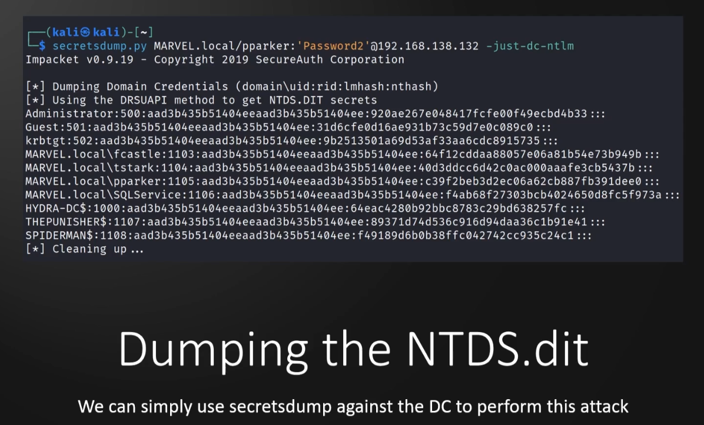
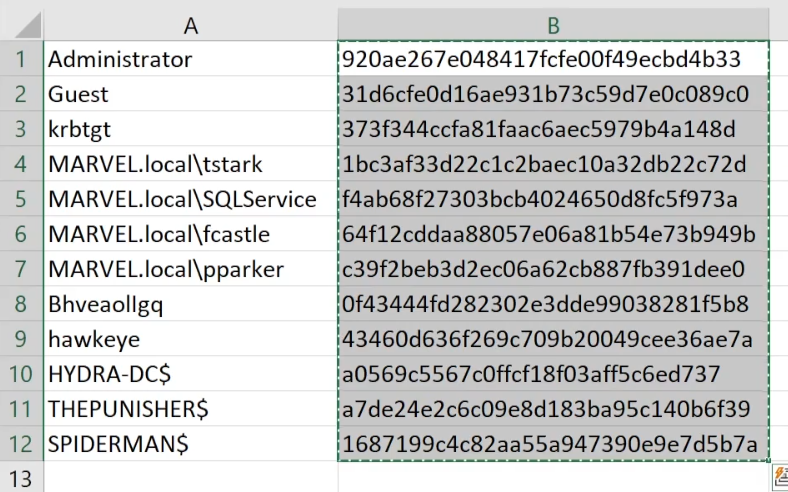

**What**?  
A database used to store AD data. This data includes:  
- User information  
- Group information  
- Security description  
- **Password hashes**  

First time doing this btw:  
  

## Lab

**Command**:  
`secretsdump.py MARVEL.local/hawkeye:'Password1@'@192.168.138.136`  

And this dumps the NTDS.dit too along with so much more  
but to only get NTDS.dit:  
->`secretsdump.py MARVEL.local/hawkeye:'Password1@'@192.168.138.136 -just-dc-ntlm`  

#### **Note:**
remeber just take the NT (LM:**NT**) part of the hash for cracking

#### **Tip:** 
-> Copy everything on a hash from the dump and paste it in excel. Then Do "text to column" and put `:` as the delimiter. This will put the NT part and the LM part in seperate columns along with some more unwanted columns. Just delete them columns:)
So now I have just this:  
  

-> Now I would just copy the whole hashes column and put it in a .txt file for cracking. EZ  

-> Also after cracking the hashes, paste the whole `--show` result from hashcat and put it on a different sheet and then do a vlookup to show them on sheet 1. (This last tip is for when you have a lots of users and hashes and passwords)  

-> AND, PC passwords are not that useful when cracking, so its best not to try and crack them (maybe to save time). **ONLY crack user account hashes**.  

