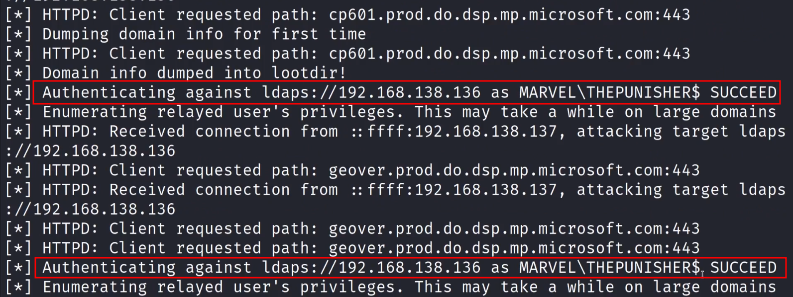
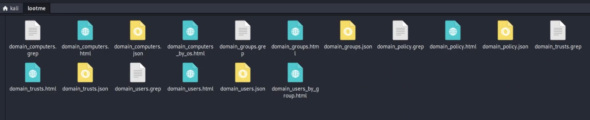
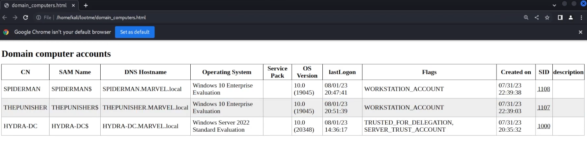
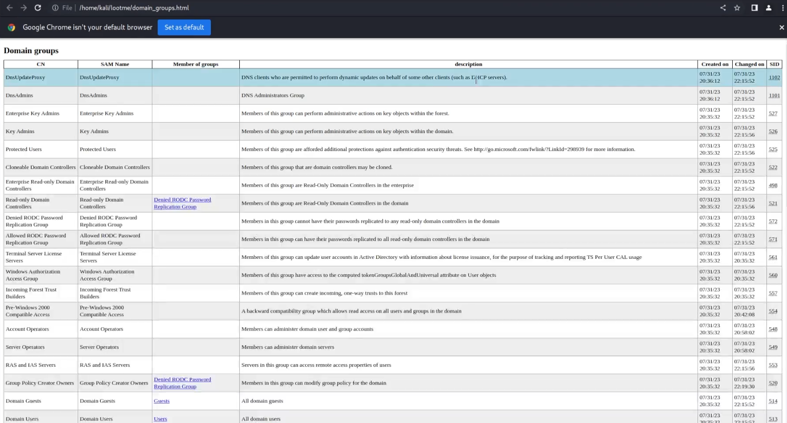
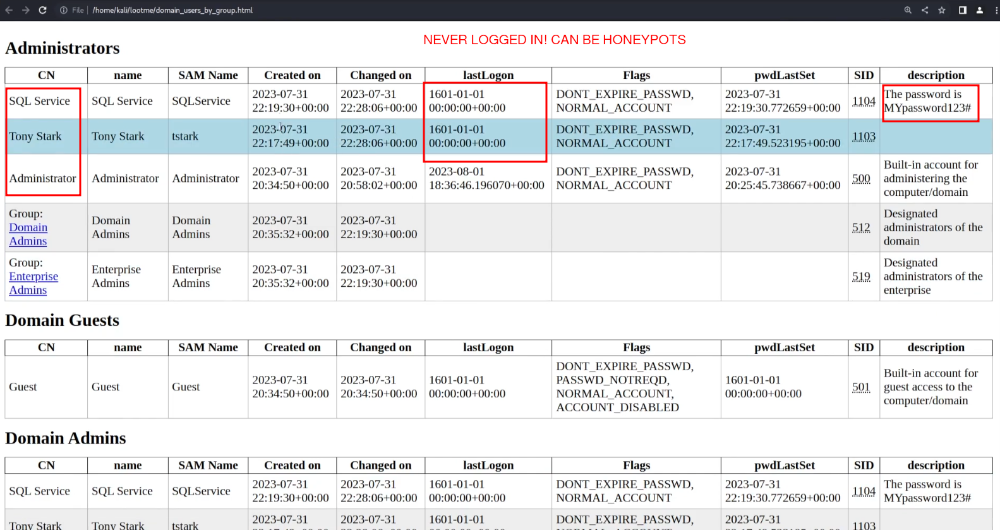
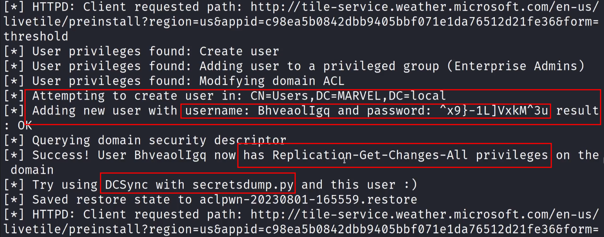

......DNS takeover attacks over IPv6
......Kind of like relaying


Tool : MITM6

Very prominent

Basic Idea of the attack:
1. Most of the computers user ipv4 addresses to communicate and not the ipv6 addresses
2. But the IPv6 addresses  are still on and there is no one to resolve their DNS
3. That is where the attacker comes in and spoofs a DNS server for IPv6
4. Hence acting as a **Man in the Middle**

---

## How I went about it

```
Install mitm6 on kali

cd /opt/mitm6
sudo pip2 install .


OR  search mitm6 guthub
```

```
**!!!! Note:** nevert run this attack for long durations
only run it for small sprints like for 5-10 mins
```

#### Process
**Step 1 :**
`sudo mitm6 -f marvel.local (DO NOT RUN)`

**Step 2 :** 
```
ntlmrelay -6 -t ldaps://192.168.138.236 -wh fakewpad.marvel.local -l lootme

-6 is for ipv6
-t is for target
-wh is for wpad (fake)
-l is for loot (the term lootme can be anything)
```


**Step 3:** 
Run the command in step 1, i.e., mitm6 



#### Findings:
After this a lootme folder was created in the base folder with all this information:


this is from the tool called  "ldap doamin dump"

here we got informations like:
- what computers are in the domain
  
  Goal: To find computers running older OS as they tend to have more vulnerabilities!
- Look at the Domain groups present in the domain
  
  Goal: Understand the AD better
- Look at the "Domain users"(list of users) and "Domain users by group"(list of users sorted by respective group names)
  
  GOAL: Identify high value targets


**Step 4:**
Kept the mitm6 and ntlmrelay running(still on the network) and when the administrator actually logged in (Event) 
,,,,mitm6 managed to create a totally new user that had Enterprise Admins level of access


---

## Mitigation:

1. **IPv6 Poisoning Prevention**
   
   IPv6 poisoning abuses the fact that Windows queries for IPv6 addresses in IPv4-only environments. If you do not use IPv6 internally, the safest way to prevent mitm6 is to block DHCPv6 traffic and incoming router advertisements in Windows Firewall via Group Policy. Disabling IPv6 entirely may have unwanted side effects.
   
   Set the following predefined rules to **Block** instead of **Allow** to prevent the attack from working:
   - (Inbound) Core Networking - Dynamic Host Configuration Protocol for IPv6 (DHCPv6-In)
   - (Inbound) Core Networking - Router Advertisement (ICMPv6-In)
   - (Outbound) Core Networking - Dynamic Host Configuration Protocol for IPv6 (DHCPv6-Out)

2. **WPAD Mitigation**
   
   If WPAD is not in use internally, disable it via Group Policy and by disabling the `WinHttpAutoProxySvc` service.

3. **LDAP Relay Mitigation**
   
   Relaying to LDAP and LDAPS can only be mitigated by enabling both LDAP signing and LDAP channel binding.

4. **Administrative User Protection**
   
   Consider adding administrative users to the Protected Users group or marking them as "Account is sensitive and cannot be delegated," which will prevent any impersonation of that user via delegation.
