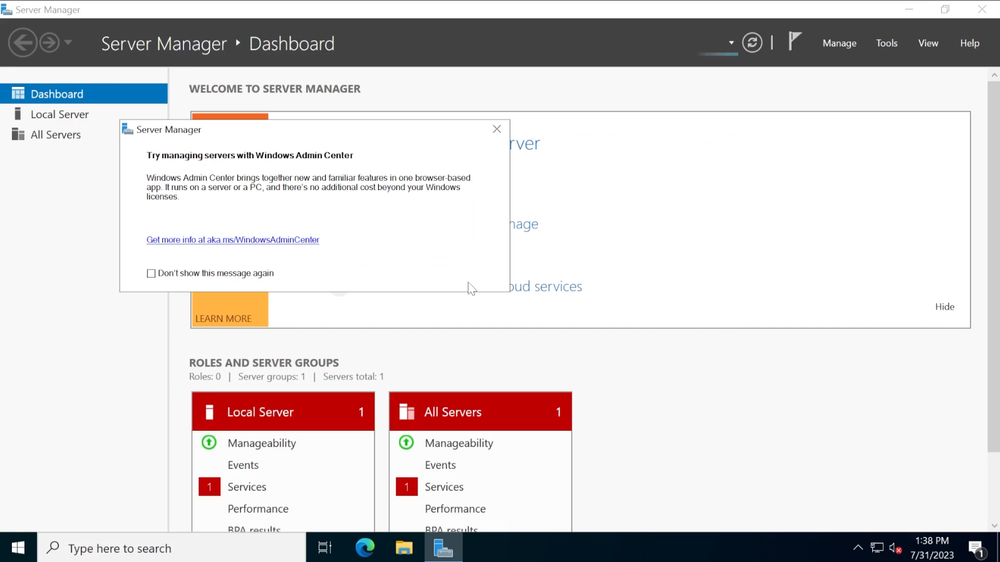

## Requirements
Right, now that we understand what AD is....what do we need to make this lab?

As AD most common for windows systems. We need to download a few ISO files. 
Specifically these:
  - For Domain Controller: https://www.microsoft.com/en-us/evalcenter/evaluate-windows-server-2022
  - For 2 User Machines: https://www.microsoft.com/en-us/evalcenter/evaluate-windows-10-enterprise

I followed the PEH course by TCM Security to build this lab, which is why I installed an older version of windows. (You may try the newer 2025 version which you can find [here](https://www.microsoft.com/en-us/evalcenter), as far as I know it won't matter much)

**Also, this setup would approximately require a 60 GB of disk space for each virtual machine (180 GB total) and atleast 16 GB of RAM.**

## Procedure
We will be building this entire lab on virtual machines so open your favourite hypervisor software, keep all your necessary ISOs downloaded, brew that coffee and let's get started.

### Domain Controller
We will start with setting up the Domain Controller first. This is a server that uses the active directory to authenticate and authorize domain access active directory.

**Step 1** 
- Open your hypervisor (VMWare, VirtualBox, KVM etc.) and start a new virtual machine and select the ISO file of the windows server (SERVER_EVAL_x64FRE....)
- Choose the OS and version if it hasn't detected it automatically and specify the location (keep in mind the storage requirements while choose the location)
- While setting up the DC we might require a higher amount of RAM like 8GB but after we are done with the setup we can always bring it down to a lower number like 4 or even 2 GB

*Note: Remember to press any key when "Press any Key" text shows up while booting the first time*

**Step 2**
Now just follow the steps that shows up while booting and the virtual machine would be ready. Some important selections:
- **OS**: Windows Server 2022 Standard Evaluation (Desktop Experience)
- **Type of Installation**: Custom
- **Where to install**: New -> Apply -> Okay -> Select partition that says 'total size = 59.9 GB' -> Next

**Step 3**
Set the administrator password. What I chose: `P@$$w0rd!` (weak password which exists at actual orgs

**Step 4**
Once it is running I renamed the computer:  
- Start -> View your PC name -> Rename this PC    -> Name your DC -> Reboot. 

What I used = **HYDRA-DC**

**Step 5**
This computer is not yet a Domain controller. So we need to make it one first.  

Server Manager -> Manage Tab -> Add roles and Features -> Add Roles and Features wizard -> Next on "Before you begin" -> "Installation Type":Role Based or feature based installation -> Next -> Next on HYDRA-DC in "Server Selection" -> In "Server Roles", make sure Active Directory Domain Services is ticked -> Hit Next up until "Confirmation" and tick the 'Restart the destination server automatically if required' option -> Install

**Step 6**
Now after the installation finishes. Click on "Promote this server to a domain controller" and select "Add a new forest" as the deployment operation. (Name it whatever you like and hit next)
-> What I named = MARVEL.local

Choose a password in the domain controller options
-> What I used = `P@$$w0rd!` (same as the admin user account)

Hit 'next' up until the Installation tab (make sure it said "All prerequisite checks pased successfully" in the prerequisites tab),  then click Install.
-> This will log you out and reboot automatically

Now Log in as MARVEL\Administrator with password `P@$$w0rd!`

**Step 7**
Last thing we need to add is the certification services for some attacks later.
Take the same steps as in step 5 but this time make sure "Active Directory Certificate Services" is ticked. 
-> Certificate services are used to verify identities in a DC. Allows us to use LDAPS

Then continue following the step 5 steps again to install.

After installation completes select "Configure Active Directory Certificate Services on the destination server". Keep hitting next except here:
- make sure 'Certificate Authority' is checked in Role Services
- Validity period is up to you.

Click 'Configure' at the end and reboot and now the DC is setup!

## User Machines

We have 2 user machines. Make 2 new virtual machines with following specifications:
	Machine 1
		 - Name: THEPUNISHER
		 - RAM: Atleast 4 GB
		 - Remove the floppy disk
	Machine 2
		- Name: SPIDERMAN
		- RAM: Atleast 4 GB
		- Remove the floppy disk

The steps to set up both the machines are same as follows:

**Step 1**
Follow the steps for domain controller till step 2 except for some stuff like the OS name. Now the windows setup wizard will start, follow the steps and you will get to a screen that says "Sign in with Microsoft".

Step 2
When there, select the "Domain join instead" option. This will allow us to use a local account instead of creating an online account. Here you will need to choose a user name and password. What I used:
	THEPUNISHER Machine
		- Username: frankcastle
		- Password: Password1
		- Security question: upto you 
		- Put 'no' for all the privacy points
		- skip cortana
	SPIDERMAN Machine
		- Username: peterparker
		- Password: Password1 (both having the same password replicates the real world scenario of Password Reuse)
		- Security question: upto you 
		- Put 'no' for all the privacy points
		- skip cortana
